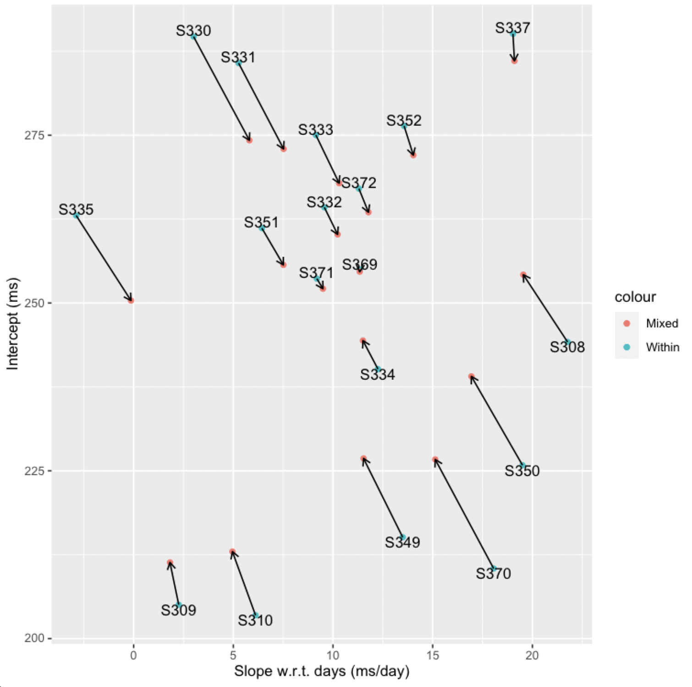
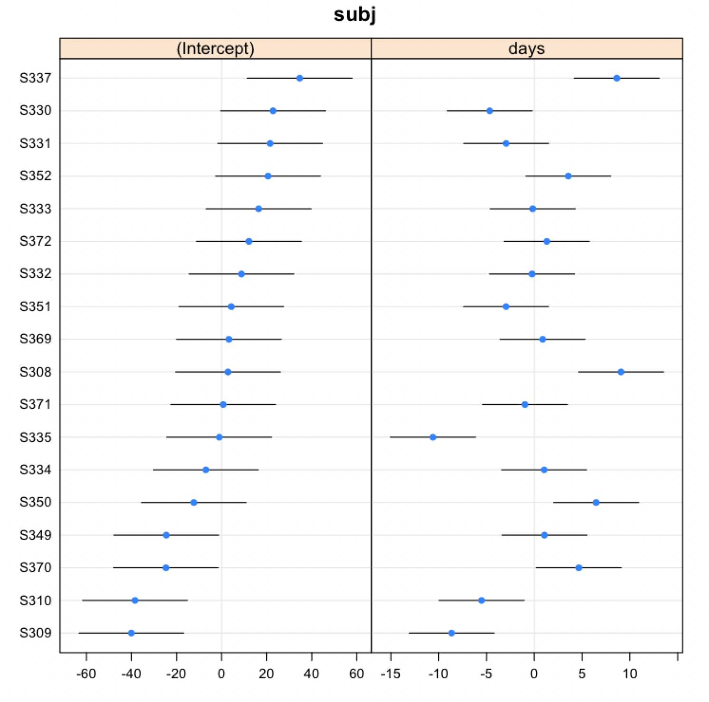

# Linear Mixed Models in Julia

This section is heavily copied from Doug Bates' work. See [his julia code](https://github.com/smlp2020-stream4/SMLP2020/blob/master/scripts/Longitudinal.jmd) and the links in the Post-workshop learning section for more information.


First, I will create a project folder with `DrWatson` to play with the linear mixed models functions:
```julia
using DrWatson
initialize_project("toy-lmm";authors="CSL")
cd("toy-lmm")
@quickactivate
```
In this project, we need to install:
```julia
(toy-lmm) pkg> add DataFrames, JellyMe4, RCall, MixedModels

(toy-lmm) pkg> status
Status `~/Dropbox/Documents/teaching/julia-workshop/toy-lmm/Project.toml`
  [a93c6f00] DataFrames v0.21.7
  [634d3b9d] DrWatson v1.16.1
  [19ac8677] JellyMe4 v0.2.1
  [ff71e718] MixedModels v3.0.0
  [6f49c342] RCall v0.13.9
```

## Running LMM in Julia

The code below is also contained in the `day1_3mixedmodels.jmd` Julia Markdown file which can be weaved into a PDF or HTML file. More details below. This md version is used mostly because it is easy to render in github.
You can also write the commands in a `.jl` file in the `scripts` subfolder. More in the Exercise below.

```julia
using DataFrames, JellyMe4, MixedModels, RCall
```

### Data from a study on sleep deprivation

Belenky et al. (2003) conducted an experiment to measure the 
effect of sleep deprivation on cognitive performance.
There were 18 subjects, chosen from the population of interest
(long-distance truck drivers), in the 10 day trial. These subjects were  restricted to 3 hours sleep per night during the trial.

On each day of the trial each subject's reaction time was measured.
The reaction time shown here is the average of several measurements.

These data are *balanced* in that each subject is measured the same number of times and on the same occasions.

Load the data:

```julia
julia> sleepstudy = DataFrame(MixedModels.dataset(:sleepstudy));
julia> describe(sleepstudy)

3×8 DataFrame
│ Row │ variable │ mean    │ min     │ median  │ max     │ nunique │ nmissing │ eltype   │
│     │ Symbol   │ Union…  │ Any     │ Union…  │ Any     │ Union…  │ Nothing  │ DataType │
├─────┼──────────┼─────────┼─────────┼─────────┼─────────┼─────────┼──────────┼──────────┤
│ 1   │ subj     │         │ S308    │         │ S372    │ 18      │          │ String   │
│ 2   │ days     │ 4.5     │ 0       │ 4.5     │ 9       │         │          │ Int8     │
│ 3   │ reaction │ 298.508 │ 194.332 │ 288.651 │ 466.353 │         │          │ Float64  │
```

and plot the data using the _lattice_ package in R

Load the `lattice` package in `R` and set the graphics device to SVG (scalable vector graphics).

```julia
R"""
require("ggplot2", quietly=TRUE)
require("lattice", quietly=TRUE)
require("lme4", quietly=TRUE)
""";
RCall.ijulia_setdevice(MIME("image/svg+xml"), width=6, height=3.5)
```

Transfer the Julia `DataFrame` to an R `data.frame` with the same name

```julia
@rput sleepstudy;
```

More on Julia macros [here](https://docs.julialang.org/en/v1/manual/metaprogramming/#man-macros).

We then produce the plot

```julia
R"""
xy <- xyplot(
    reaction ~ days | subj, sleepstudy, aspect = "xy",
    layout = c(9,2), type = c("g", "p", "r"),
    index.cond = function(x,y) coef(lm(y ~ x))[1],
    xlab = "Days of sleep deprivation",
    ylab = "Average reaction time (ms)"
)
"""
```


Note that the data for each subject is presented as a separate panel. A reference line fit by simple linear regression to the panel's data has been added to each panel.  Also, the aspect ratio of the panels has been adjusted so that a typical reference line lies about $45^\circ$ on the page.
We have the greatest sensitivity in checking for differences in slopes when the lines are near $\pm 45^\circ$ on the page.

Importantly, the panels have been ordered not by subject number (which is essentially a random order) but according to increasing intercept for the simple linear regression.
If the slopes and the intercepts are highly correlated we should see a pattern across the panels in the slopes.

Before commenting on the within-subject linear regressions we will show how to evaluate the coefficients of those regression models using the Julia version of Hadley Wickham's [_split-apply-combine_](https://vita.had.co.nz/papers/plyr.pdf) strategy.

### The _groupby-do-combine_ strategy in Julia

Suppose we wish to evaluate the coefficients of the within-subject regressions.

We will show one way of performing this kind of functional programming in Julia using a _do-block_, which is a way of writing an anonymous function.

The `split` part is done by a function called `groupby`.
The first argument is the data frame and the second argument is the name of a column or a vector of column names as _symbols_.
A symbol is written in Julia with a colon followed by the name.

The general pattern is
```
sumry = combine(groupby(df, factor_name)) do sdf
        # operate on columns of the subDataFrame
    end
```

The statements between `do` and `end` are the body of the function to apply to the subDataFrame `sdf`.  This anonymous function should end in creating a `Tuple` of name/value pairs.


Back to our coefficients of the within-subject regressions:
For each subject the `days` column is the `x` in the regression and the `reaction` column is the `y`.
We create the model matrix using `hcat` (horizontal concatenate), which is the Julia analogue of R's `cbind`.

```julia
julia> let days = 0:9
           hcat(ones(length(days)), days)
       end
10×2 Array{Float64,2}:
 1.0  0.0
 1.0  1.0
 1.0  2.0
 1.0  3.0
 1.0  4.0
 1.0  5.0
 1.0  6.0
 1.0  7.0
 1.0  8.0
 1.0  9.0
```

and use the backslash operator to evaluate the coefficients.

Putting this together looks like

```julia
julia> withinsubj = combine(groupby(sleepstudy, :subj)) do sdf
           days = sdf.days
           X = hcat(ones(length(days)), days)
           coefs = X \ sdf.reaction
           (intercept = first(coefs), slope = last(coefs), )
       end
18×3 DataFrame
│ Row │ subj   │ intercept │ slope    │
│     │ String │ Float64   │ Float64  │
├─────┼────────┼───────────┼──────────┤
│ 1   │ S308   │ 244.193   │ 21.7647  │
│ 2   │ S309   │ 205.055   │ 2.26179  │
│ 3   │ S310   │ 203.484   │ 6.1149   │
│ 4   │ S330   │ 289.685   │ 3.00807  │
│ 5   │ S331   │ 285.739   │ 5.26602  │
│ 6   │ S332   │ 264.252   │ 9.56677  │
│ 7   │ S333   │ 275.019   │ 9.14205  │
│ 8   │ S334   │ 240.163   │ 12.2531  │
│ 9   │ S335   │ 263.035   │ -2.88103 │
│ 10  │ S337   │ 290.104   │ 19.026   │
│ 11  │ S349   │ 215.112   │ 13.4939  │
│ 12  │ S350   │ 225.835   │ 19.504   │
│ 13  │ S351   │ 261.147   │ 6.4335   │
│ 14  │ S352   │ 276.372   │ 13.5665  │
│ 15  │ S369   │ 254.968   │ 11.3481  │
│ 16  │ S370   │ 210.449   │ 18.0562  │
│ 17  │ S371   │ 253.636   │ 9.18844  │
│ 18  │ S372   │ 267.045   │ 11.2981  │
```

The advantage of using this formulation is that it is easy to extend the quantities being evaluated and returned.
Suppose we wish to return the sum of squared residuals in addition to the coefficient estimates.

```julia
withinsubj = combine(groupby(sleepstudy, :subj)) do sdf
    days, rt = sdf.days, sdf.reaction
    X = hcat(ones(length(days)), days)
    coefs = X \ rt
    dfr = length(days) - 2  # degrees of freedom for residuals
    ssr = sum(abs2, rt - X * coefs) # sum of squared residuals
    (intercept = first(coefs), slope = last(coefs),
    ssr = ssr, dfr = dfr, s = sqrt(ssr / dfr), )
end
```

```julia
julia> describe(withinsubj)
6×8 DataFrame
│ Row │ variable  │ mean    │ min      │ median  │ max     │ nunique │ nmissing │ eltype   │
│     │ Symbol    │ Union…  │ Any      │ Union…  │ Any     │ Union…  │ Nothing  │ DataType │
├─────┼───────────┼─────────┼──────────┼─────────┼─────────┼─────────┼──────────┼──────────┤
│ 1   │ subj      │         │ S308     │         │ S372    │ 18      │          │ String   │
│ 2   │ intercept │ 251.405 │ 203.484  │ 258.058 │ 290.104 │         │          │ Float64  │
│ 3   │ slope     │ 10.4673 │ -2.88103 │ 10.4324 │ 21.7647 │         │          │ Float64  │
│ 4   │ ssr       │ 5239.53 │ 630.089  │ 3678.75 │ 29666.8 │         │          │ Float64  │
│ 5   │ dfr       │ 8.0     │ 8        │ 8.0     │ 8       │         │          │ Int64    │
│ 6   │ s         │ 22.1821 │ 8.87474  │ 21.4263 │ 60.8963 │         │          │ Float64  │
```

In most cases a simple linear regression provides an adequate fit to the within-subject data. 
Patterns for some subjects (e.g. 350, 352 and 371) deviate from linearity but the deviations are neither widespread nor consistent in form.

There is considerable variation in the intercept (estimated reaction time without sleep deprivation) across subjects -- 200 ms. up to 300 ms. -- and in the slope (increase in reaction time per day of sleep deprivation) -- 0 ms./day up to 20 ms./day.
Also there is considerable variability in the quality of the fit as measured by `s`, the estimate of `σ`, which ranges from about 9 to over 60 ms.

## Fit a linear mixed-effects model

Begin with a linear mixed-effects model with fixed effects for intercept and slope (w.r.t. `days`) and by-subject random effects for intercept and slope.
By default the slope and intercept random effects are correlated within subject.

```julia
julia> f1 =  @formula(reaction ~ 1 + days + (1+days|subj));

julia> m1 = fit(MixedModel, f1, sleepstudy)
Linear mixed model fit by maximum likelihood
 reaction ~ 1 + days + (1 + days | subj)
   logLik   -2 logLik     AIC       AICc        BIC    
  -875.9697  1751.9393  1763.9393  1764.4249  1783.0971

Variance components:
            Column   Variance Std.Dev.   Corr.
subj     (Intercept)  565.5107 23.78047
         days          32.6821  5.71683 +0.08
Residual              654.9414 25.59182
 Number of obs: 180; levels of grouping factors: 18

  Fixed-effects parameters:
──────────────────────────────────────────────────
                Coef.  Std. Error      z  Pr(>|z|)
──────────────────────────────────────────────────
(Intercept)  251.405      6.63226  37.91    <1e-99
days          10.4673     1.50224   6.97    <1e-11
──────────────────────────────────────────────────
```

The random-effects "estimates" (technically, these are the conditional means of the random effects given the observed data) can be obtained as

```julia
julia> ranefvals = DataFrame(only(raneftables(m1)))
18×3 DataFrame
│ Row │ subj   │ (Intercept) │ days      │
│     │ String │ Float64     │ Float64   │
├─────┼────────┼─────────────┼───────────┤
│ 1   │ S308   │ 2.81582     │ 9.07551   │
│ 2   │ S309   │ -40.0484    │ -8.64408  │
│ 3   │ S310   │ -38.4331    │ -5.5134   │
│ 4   │ S330   │ 22.8321     │ -4.65872  │
│ 5   │ S331   │ 21.5498     │ -2.94449  │
│ 6   │ S332   │ 8.81554     │ -0.235201 │
│ 7   │ S333   │ 16.4419     │ -0.158809 │
│ 8   │ S334   │ -6.99667    │ 1.03273   │
│ 9   │ S335   │ -1.03759    │ -10.5994  │
│ 10  │ S337   │ 34.6663     │ 8.63238   │
│ 11  │ S349   │ -24.558     │ 1.06438   │
│ 12  │ S350   │ -12.3345    │ 6.47168   │
│ 13  │ S351   │ 4.274       │ -2.95533  │
│ 14  │ S352   │ 20.6222     │ 3.56171   │
│ 15  │ S369   │ 3.25854     │ 0.871711  │
│ 16  │ S370   │ -24.7101    │ 4.6597    │
│ 17  │ S371   │ 0.723262    │ -0.971053 │
│ 18  │ S372   │ 12.1189     │ 1.3107    │
```

To put these on the same scale as the by-subject regression coefficients we add in the fixed-effects estimates.

```julia
let fe = fixef(m1)
    ranefvals[2] .+= fe[1]
    ranefvals[3] .+= fe[2]
end;
```

```julia
julia> describe(ranefvals)
3×8 DataFrame
│ Row │ variable    │ mean    │ min      │ median  │ max     │ nunique │ nmissing │ eltype   │
│     │ Symbol      │ Union…  │ Any      │ Union…  │ Any     │ Union…  │ Nothing  │ DataType │
├─────┼─────────────┼─────────┼──────────┼─────────┼─────────┼─────────┼──────────┼──────────┤
│ 1   │ subj        │         │ S308     │         │ S372    │ 18      │          │ String   │
│ 2   │ (Intercept) │ 251.405 │ 211.357  │ 254.442 │ 286.071 │         │          │ Float64  │
│ 3   │ days        │ 10.4673 │ -0.13213 │ 10.8237 │ 19.5428 │         │          │ Float64  │
```

and combine these values with the within-subject estimates

```julia
julia> coefs = innerjoin(ranefvals, withinsubj, on = :subj)
18×8 DataFrame
│ Row │ subj   │ (Intercept) │ days     │ intercept │ slope    │ ssr     │ dfr   │ s       │
│     │ String │ Float64     │ Float64  │ Float64   │ Float64  │ Float64 │ Int64 │ Float64 │
├─────┼────────┼─────────────┼──────────┼───────────┼──────────┼─────────┼───────┼─────────┤
│ 1   │ S308   │ 254.221     │ 19.5428  │ 244.193   │ 21.7647  │ 18263.2 │ 8     │ 47.7797 │
│ 2   │ S309   │ 211.357     │ 1.82321  │ 205.055   │ 2.26179  │ 630.089 │ 8     │ 8.87474 │
│ 3   │ S310   │ 212.972     │ 4.95389  │ 203.484   │ 6.1149   │ 1214.32 │ 8     │ 12.3203 │
│ 4   │ S330   │ 274.237     │ 5.80857  │ 289.685   │ 3.00807  │ 3976.98 │ 8     │ 22.2962 │
│ 5   │ S331   │ 272.955     │ 7.52279  │ 285.739   │ 5.26602  │ 4391.63 │ 8     │ 23.4298 │
│ 6   │ S332   │ 260.221     │ 10.2321  │ 264.252   │ 9.56677  │ 29666.8 │ 8     │ 60.8963 │
│ 7   │ S333   │ 267.847     │ 10.3085  │ 275.019   │ 9.14205  │ 1241.77 │ 8     │ 12.4588 │
│ 8   │ S334   │ 244.408     │ 11.5     │ 240.163   │ 12.2531  │ 3380.52 │ 8     │ 20.5564 │
│ 9   │ S335   │ 250.368     │ -0.13213 │ 263.035   │ -2.88103 │ 1037.6  │ 8     │ 11.3886 │
│ 10  │ S337   │ 286.071     │ 19.0997  │ 290.104   │ 19.026   │ 2130.98 │ 8     │ 16.3209 │
│ 11  │ S349   │ 226.847     │ 11.5317  │ 215.112   │ 13.4939  │ 1570.89 │ 8     │ 14.0129 │
│ 12  │ S350   │ 239.071     │ 16.939   │ 225.835   │ 19.504   │ 4747.49 │ 8     │ 24.3606 │
│ 13  │ S351   │ 255.679     │ 7.51195  │ 261.147   │ 6.4335   │ 4143.28 │ 8     │ 22.7576 │
│ 14  │ S352   │ 272.027     │ 14.029   │ 276.372   │ 13.5665  │ 5209.65 │ 8     │ 25.5187 │
│ 15  │ S369   │ 254.664     │ 11.339   │ 254.968   │ 11.3481  │ 2005.24 │ 8     │ 15.8321 │
│ 16  │ S370   │ 226.695     │ 15.127   │ 210.449   │ 18.0562  │ 4653.48 │ 8     │ 24.1182 │
│ 17  │ S371   │ 252.128     │ 9.49623  │ 253.636   │ 9.18844  │ 5028.91 │ 8     │ 25.0722 │
│ 18  │ S372   │ 263.524     │ 11.778   │ 267.045   │ 11.2981  │ 1018.63 │ 8     │ 11.284  │

julia> @rput coefs
```

A scatter plot of the within-subject estimates versus the predictions from the mixed-effects model shows shrinkage toward the population mean.

```julia
RCall.ijulia_setdevice(MIME("image/svg+xml"), width=6, height=5)
R"""
p <- ggplot(coefs, aes(slope, intercept)) +
    geom_point(aes(color="Within")) +
    geom_text(aes(label=subj), vjust="outward") +
    geom_point(aes(days, `(Intercept)`, color="Mixed")) +
    geom_segment(aes(xend=days, yend=`(Intercept)`),
        arrow = arrow(length=unit(0.015, "npc"))) +
    xlab("Slope w.r.t. days (ms/day)") +
    ylab("Intercept (ms)")
"""
```


Our basic assumption is that the subjects are a random sample from the population of interest so it would make sense that they have some characteristics in common.
The value of the slope and intercept from the mixed-effects model for a particular subject is a compromise between the population values (i.e. the fixed effects estimates) and the within-subject estimate.

### Simplifying the random-effects structure

The estimate of the within-subject correlation of the random effects for slope and intercept is 0.08, indicating that it may be reasonable to model the random-effects as independent.
We can fit such a model as

```julia
julia> f2 = @formula(reaction ~ 1 + days + zerocorr(1+days|subj));

julia> m2 = fit(MixedModel, f2, sleepstudy)
Linear mixed model fit by maximum likelihood
 reaction ~ 1 + days + MixedModels.ZeroCorr((1 + days | subj))
   logLik   -2 logLik     AIC       AICc        BIC    
  -876.0016  1752.0033  1762.0033  1762.3481  1777.9680

Variance components:
            Column   Variance Std.Dev.   Corr.
subj     (Intercept)  584.2590 24.17145
         days          33.6328  5.79938   .  
Residual              653.1158 25.55613
 Number of obs: 180; levels of grouping factors: 18

  Fixed-effects parameters:
──────────────────────────────────────────────────
                Coef.  Std. Error      z  Pr(>|z|)
──────────────────────────────────────────────────
(Intercept)  251.405      6.70771  37.48    <1e-99
days          10.4673     1.51931   6.89    <1e-11
──────────────────────────────────────────────────
```

Because model `m2` is nested within `m1`, which means that it is a special case of `m1`, we can use a likelihood ratio test to compare them.

```julia
julia> MixedModels.likelihoodratiotest(m2, m1)
Model Formulae
1: reaction ~ 1 + days + MixedModels.ZeroCorr((1 + days | subj))
2: reaction ~ 1 + days + (1 + days | subj)
─────────────────────────────────────────────────
     model-dof   deviance      χ²  χ²-dof  P(>χ²)
─────────────────────────────────────────────────
[1]          5  1752.0033                        
[2]          6  1751.9393  0.0639       1  0.8004
─────────────────────────────────────────────────
```

The large p-value indicates that `m1` is not a substantially better fit than `m2` so we adopt the simpler `m2`.
Also the values of AIC, BIC and AICc, where smaller is better, all prefer `m2`.

```julia
julia> DataFrame(map(m -> (objective = objective(m), AIC = aic(m), AICc = aicc(m), BIC = bic(m)), [m2, m1]))
2×4 DataFrame
│ Row │ objective │ AIC     │ AICc    │ BIC     │
│     │ Float64   │ Float64 │ Float64 │ Float64 │
├─────┼───────────┼─────────┼─────────┼─────────┤
│ 1   │ 1752.0    │ 1762.0  │ 1762.35 │ 1777.97 │
│ 2   │ 1751.94   │ 1763.94 │ 1764.42 │ 1783.1  │
```

### Properties of `LinearMixedModel`

The model is saved as a `LinearMixedModel` object which has certain properties that we can extract using a '.' after the model's name.

```julia
julia> typeof(m1)
LinearMixedModel{Float64}

julia> propertynames(m1)
(:formula, :sqrtwts, :A, :L, :optsum, :θ, :theta, :β, :beta, :λ, :lambda, :stderror, :σ, :sigma, :σs, :sigmas, :b, :u, :lowerbd, :X, :y, :corr, :vcov, :PCA, :rePCA, :reterms, :feterms, :allterms, :objective, :pvalues)

julia> m1.formula
FormulaTerm
Response:
  reaction(continuous)
Predictors:
  1
  days(continuous)
  (1 + days | subj)

julia> m1.objective
1751.9393444647123
```

## Creating an `lmer` model from a `LinearMixedModel`

Phillip Alday has created the `JellyMe4` package to allow you to create an `lmer` model from a `LinearMixedModel`.
Because the `lme4` package stores a `model.frame` as part of a linear mixed-effects model object, a Tuple of the model and the data frame must be passed to R.
We can use the `$`-interpolation technique for inserting the value of objects in strings.

```julia
julia> R"summary(m1 <- $(m1, sleepstudy))"
RObject{VecSxp}
Linear mixed model fit by maximum likelihood  ['lmerMod']
Formula: reaction ~ 1 + days + (1 + days | subj)
   Data: jellyme4_data
Control: lmerControl(optimizer = "nloptwrap", optCtrl = list(maxeval = 1),  
    calc.derivs = FALSE, check.nobs.vs.nRE = "warning")

     AIC      BIC   logLik deviance df.resid 
  1763.9   1783.1   -876.0   1751.9      174 

Scaled residuals: 
    Min      1Q  Median      3Q     Max 
-3.9416 -0.4656  0.0289  0.4636  5.1793 

Random effects:
 Groups   Name        Variance Std.Dev. Corr
 subj     (Intercept) 565.51   23.780       
          days         32.68    5.717   0.08
 Residual             654.94   25.592       
Number of obs: 180, groups:  subj, 18

Fixed effects:
            Estimate Std. Error t value
(Intercept)  251.405      6.632  37.906
days          10.467      1.502   6.968

Correlation of Fixed Effects:
     (Intr)
days -0.138
```

Reason to move the model to R: [`lme4` package](https://github.com/lme4/lme4) has many methods for producing plots and other diagnostics for an `lmerMod` object.

For example, the `dotplot` method for the `ranef.mer` class produces a comparative plot of prediction intervals on the random effects, in increasing order by the first component.

```julia
RCall.ijulia_setdevice(MIME("image/svg+xml"), width=6, height=4.5)
R"""
dotplot(ranef(m1),
    scales = list(x = list(relation = 'free')))[['subj']]
"""
```


An alternative is a `qqmath`, or normal-probability, plot.
For this plot the order of the groups is determined separately for each panel.

```julia
R"qqmath(ranef(m1))[['subj']]"
```


## Exercise (15 minutes)

1. Install [Visual Studio Code](https://code.visualstudio.com/) with Julia extension
2. Clone the `toy-lmm` repo: `git clone https://github.com/crsl4/toy-lmm.git`
3. Open the `day1_3mixedmodels.jmd` or the `day1_3mixedmodels.jl` file in VSCode
4. Shift-cmd-P to open the commands window and search for `Julia: Start REPL`
5. Type `]` in the Terminal window in VSCode to get the pkg prompt
6. `pkg> activate .`
7. Use backspace to get back to the julia prompt
8. Try to run the commands with Ctrl+return


# Post-workshop learning
- RePsychLing [tutorial](https://repsychling.github.io/tutorial.html)
- SMLP2020 [tutorial](https://github.com/smlp2020-stream4/SMLP2020)
- Doud Bates [NextJournal article](https://nextjournal.com/dmbates/complexity-in-fitting-linear-mixed-models) 